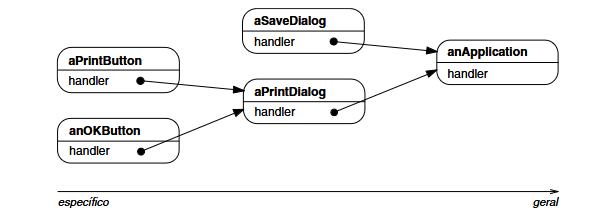
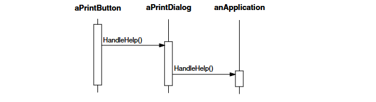
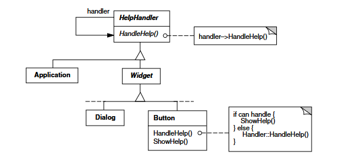
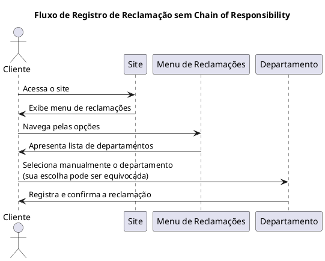
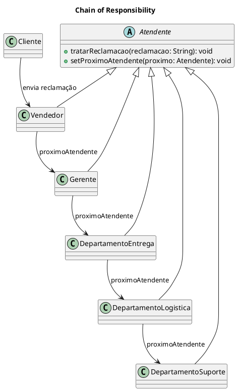
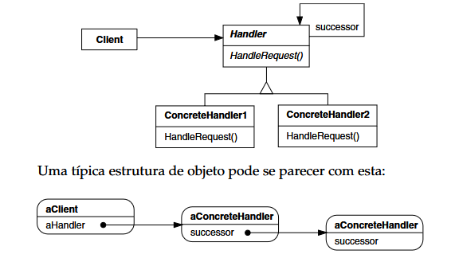

# Chain Of Responsibility

## Intenção

Desacoplar uma abstração da sua implementação, de modo que as duas possam variar independentemente.

## Motivação GOF 

Considere um recurso de help sensível ao contexto para uma interface gráfica de usuário. O usuário pode obter informação de ajuda em qualquer parte da interface simplesmente pressionando o botão do mouse sobre ela. A ajuda que é fornecida depende da parte da interface que é selecionada e do seu contexto; por exemplo, um botão numa caixa de diálogo pode ter uma informação de ajuda diferente da de um botão similar na janela principal. Se não houver uma informação específica de ajuda para aquela parte da interface, então o sistema de ajuda deveria exibir uma mensagem de ajuda mais genérica sobre o contexto imediato – por exemplo, a caixa de diálogo como um todo. 

Daí ser natural organizar a informação de ajuda de acordo com a sua generalidade do mais específico para o mais genérico. Além do mais, está claro que uma solicitação de ajuda é tratada por um entre vários objetos da interface do usuário; qual objeto depende do contexto e de quão específica é a ajuda disponível.O problema aqui é que o objeto que na prática fornece a ajuda não é conhecido explicitamente pelo objeto (por exemplo, o botão) que inicia a solicitação de ajuda. O que necessitamos é de uma maneira de desacoplar o botão que inicia a solicitação de ajuda dos objetos que podem fornecer informação de ajuda. O padrão Chain of Responsibility define como isso acontece.

A idéia desse padrão é desacoplar remetentes e receptores fornecendo a múltiplos objetos a oportunidade de tratar uma solicitação. A solicitação é passada ao longo de uma cadeia de objetos até que um deles a trate.



O primeiro objeto na cadeia que recebe a solicitação trata a mesma ou a repassa para o próximo candidato na cadeia, que faz a mesma coisa. O objeto que fez a solicitação não tem conhecimento explícito de quem a tratará dizemos que a solicitação tem um receptor implícito.

Vamos assumir que o usuário pressiona o botão do mouse solicitando ajuda sobre o botão marcado “Print”. O botão está contido numa instância de PrintDialog, o qual conhece o objeto da aplicação ao qual ele pertence (ver o diagrama de objeto precedente). O seguinte diagrama de interação ilustra como a solicitação de ajuda é repassada ao longo da cadeia:




Neste caso, nem aPrintButton nem aPrintDialog trata a solicitação; ela pára em um anApplication, o qual a trata ou a ignora. O cliente que emitiu a solicitação não possui uma referência direta para o objeto que efetivamente a realizou. Para repassar a solicitação ao longo da cadeia — e para garantir que os receptores permaneçam implícitos — cada objeto na cadeia compartilha uma interface comum para o tratamento de solicitações e para acessar seu sucessor na cadeia.

Por exemplo, o sistema de ajuda pode definir uma classe HelpHandler, com uma correspondente operação HandleHelp. HelpHandler pode ser a classe-mãe para as classes de objetos-candidatos, ou ela pode ser definida como uma classe mixin*. Então, classes que desejam tratar solicitações de ajuda podem tornar HelpHandler uma classe mãe.

* N. de T.: Uma classe mixin é uma classe usada para definir outras classes, através da combinação de suas propriedades e de outras classes mixin, pelo uso da herança múltipla.



As classes Button, Dialog e Application usam as operações de HelpHandler para tratar solicitações de ajuda. A operação HandlerHelp, de HelpHandler, repassa a solicitação para o sucessor, por falta. Subclasses podem substituir esta operação para fornecer ajuda sob as circunstâncias apropriadas; caso contrário, podem usar a implementação por falta para repassar a solicitação.

## Motivação 

Imagine que um cliente deseja registrar uma reclamação sobre um pedido que não foi entregue. Esse cliente precisaria navegar por um menu complicado no site, selecionar manualmente o setor que acredita ser o responsável e, muitas vezes, acabar direcionando a reclamação para o departamento errado. Isso não só atrasa a resolução do problema, mas também pode resultar em uma experiência frustrante para o usuário.



Com a aplicação do padrão Chain of Responsibility, o sistema assume a responsabilidade de encaminhar a reclamação de forma automática e ordenada. Ao enviar sua solicitação, o cliente não precisa se preocupar em identificar qual setor tem competência para resolver o problema. Em vez disso, a reclamação percorre uma cadeia de tratadores — por exemplo, Vendedor, Gerente, Departamento de Entregas, Departamento de Logística e, finalmente, Departamento de Suporte — onde cada objeto da cadeia verifica se possui a competência necessária para resolver a questão. Se o tratador atual não for capaz de solucionar o problema, ele repassa a solicitação para o próximo, até que a reclamação seja finalmente atendida.



## Aplicabilidade
**Utilize o Chain Of Responsibility quando**

- mais de um objeto pode tratar uma solicitação e o objeto que a tratará não conhecido a priori. O objeto que trata a solicitação deve ser escolhido automaticamente;
- você quer emitir uma solicitação para um dentre vários objetos, sem especificar explicitamente o receptor;

- o conjunto de objetos que pode tratar uma solicitação deveria ser especificado dinamicamente

  

## Estrutura




## Participantes:

- **Handler (Atendente)**

  - define uma interface para tratar solicitações.
  - (opcional) implementa o elo (link) ao sucessor.

- **ConcreteHandler (Vendedor,Gerente,DepartamentoEntrega,DepartamentoLogistica,DepartamentoSuporte)**
  - trata de solicitações pelas quais é responsável.
  - pode acessar seu sucessor.
  - se o ConcreteHandler pode tratar a solicitação, ele assim o faz; caso contrário, ele repassa a solicitação para o se sucessor.
  
- **Cliente (Cliente)**
  - inicia a solicitação para um objeto ConcreteHandler da cadeia.


## Colaborações: 
Quando um cliente emite uma solicitação, a solicitação se propaga ao longo da cadeia até que um objeto ConcreteHandler assume a responsabilidade de tratá-la

## Consequências:

A Chain of Responsibility tem os seguintes benefícios e deficiências:

1. Acoplamento reduzido. O padrão libera um objeto de ter que conhecer qual o outro objeto que trata de uma solicitação. Um objeto tem que saber somente que uma solicitação será tratada “apropriadamente”. Tanto o receptor como o remetente não têm conhecimento explícito um do outro, e um objeto que está na cadeia não necessita conhecer a estrutura da mesma. Como resultado, Chain of Responsibility pode simplificar as interconexões de objetos. Ao invés de os objetos manterem referências para todos os receptores candidatos, eles mantêm uma referência única para o seu sucessor.

2. Flexibilidade adicional na atribuição de responsabilidades a objetos. O Chain of Responsibility dá uma flexibilidade adicional na distribuição de responsabilidades entre objetos. É possível acrescentar ou mudar responsabilidades para o tratamento de uma solicitação pelo acréscimo ou mudança da cadeia em tempo de execução. Você pode combinar isto com subclasses para especializar estaticamente os handlers.

3. A recepção não é garantida. Uma vez que uma solicitação não tem um receptor explícito, não há garantia de que ela será tratada – a solicitação pode sair pelo final da cadeia sem ter sido tratada. Uma solicitação também pode não ser tratada quando a cadeia não está configurada apropriadamente.


## Implementação:

Aqui apresentamos aspectos da implementação a serem considerados ao usar Chain of Responsibility:

1. Implementando a cadeia de sucessores. Há duas maneiras possíveis de implementar a cadeia de sucessores:
(a) definir novos elos (normalmente no Handler, porém, em seu lugar os ConcreteHandlers poderiam defini-las);
(b) utilizar os existentes


2. Conectando sucessores. Se não existem referências pré-existentes para a definição de uma cadeia, então você terá que introduzi-las por conta. Nesse caso, o handler não somente define a interface para as solicitações, mas normalmente mantém a ligação para o sucessor. Isso permite ao handler fornecer uma implementação-padrão de HandleRequest que repassa a solicitação para o sucessor (se houver). Se uma subclasse ConcreteHandler não está interessada na solicitação, ela não tem que redefinir a operação de repasse,uma vez que a sua implementação default faz o repasse incondicionalmente.
3. Representando solicitações. Diferentes opções estão disponíveis para representar solicitações. Na forma mais simples, a solicitação é a invocação de uma operação codificada de maneira rígida e fixa, como no caso de HandleHelp.

### Exemplo:


#### Classe Vendedor - Handler
```java
package Handler;

public abstract class Atendente {
    protected Atendente proximoAtendente;

    // Define o próximo handler na cadeia.
    public void setProximoAtendente(Atendente proximoAtendente) {
        this.proximoAtendente = proximoAtendente;
    }

    // Método abstrato para tratar a reclamação.
    public abstract void tratarReclamacao(String reclamacao);
}
```

#### Classe Vendedor,Gerente,DepartamentoLogistica,DepartamentoEntrega,DepartametnoSuporte - ConcretHandler:
```java
package ConcreteHandler;

import Handler.Atendente;

public class Vendedor extends Atendente {
    @Override
    public void tratarReclamacao(String reclamacao) {
        if (podeTratar(reclamacao)) {
            System.out.println("Vendedor: Tratando a reclamação: \"" + reclamacao + "\"");
        } else {
            System.out.println("Vendedor: Não posso tratar essa reclamação. Encaminhando para o Gerente.");
            // Passa a responsabilidade para o próximo na cadeia.
            if (proximoAtendente != null) {
                proximoAtendente.tratarReclamacao(reclamacao);
            } else {
                System.out.println("Vendedor: Não há mais responsáveis para tratar a reclamação.");
            }
        }
    }
    
    // O Vendedor trata reclamações que não são de entrega.
    private boolean podeTratar(String reclamacao) {
        return !reclamacao.toLowerCase().contains("não chegou");
    }
}


package ConcreteHandler;

import Handler.Atendente;

public class Gerente extends Atendente {
    @Override
    public void tratarReclamacao(String reclamacao) {
        if (podeTratar(reclamacao)) {
            System.out.println("Gerente: Tratando a reclamação: \"" + reclamacao + "\"");
        } else {
            System.out.println("Gerente: Não posso tratar essa reclamação. Encaminhando para o Departamento de Entregas.");
            if (proximoAtendente != null) {
                proximoAtendente.tratarReclamacao(reclamacao);
            } else {
                System.out.println("Gerente: Não há mais responsáveis para tratar a reclamação.");
            }
        }
    }
    
    private boolean podeTratar(String reclamacao) {
        return !reclamacao.toLowerCase().contains("não chegou");
    }
}

package ConcreteHandler;

import Handler.Atendente;

public class DepartamentoLogistica extends Atendente {
    @Override
    public void tratarReclamacao(String reclamacao) {
        if (podeTratar(reclamacao)) {
            System.out.println("Departamento de Logística: Tratando a reclamação: \"" + reclamacao + "\"");
        } else {
            System.out.println("Departamento de Logística: Não posso tratar essa reclamação. Encaminhando para o Departamento de Suporte.");
            if (proximoAtendente != null) {
                proximoAtendente.tratarReclamacao(reclamacao);
            } else {
                System.out.println("Departamento de Logística: Não há mais responsáveis para tratar a reclamação.");
            }
        }
    }
    
    // Aqui, o Departamento de Logística pode tratar outro tipo de reclamação, se necessário.
    private boolean podeTratar(String reclamacao) {
        // Exemplo: trata reclamações de atraso na entrega.
        return reclamacao.toLowerCase().contains("atraso");
    }
}

package ConcreteHandler;

import Handler.Atendente;

public class DepartamentoEntrega extends Atendente {
    @Override
    public void tratarReclamacao(String reclamacao) {
        if (podeTratar(reclamacao)) {
            System.out.println("Departamento de Entregas: Tratando a reclamação: \"" + reclamacao + "\"");
        } else {
            System.out.println("Departamento de Entregas: Não posso tratar essa reclamação. Encaminhando para o Departamento de Logística.");
            if (proximoAtendente != null) {
                proximoAtendente.tratarReclamacao(reclamacao);
            } else {
                System.out.println("Departamento de Entregas: Não há mais responsáveis para tratar a reclamação.");
            }
        }
    }
    
    private boolean podeTratar(String reclamacao) {
        return reclamacao.toLowerCase().contains("não chegou");
    }
}

package ConcreteHandler;

import Handler.Atendente;

public class DepartamentoSuporte extends Atendente {
    @Override
    public void tratarReclamacao(String reclamacao) {
        if (podeTratar(reclamacao)) {
            System.out.println("Departamento de Suporte: Tratando a reclamação: \"" + reclamacao + "\"");
        } else {
            System.out.println("Departamento de Suporte: Reclamação não reconhecida ou não pode ser tratada.");
        }
    }
    
    
    private boolean podeTratar(String reclamacao) {
        return true;
    }
    
}

```

#### Classe Client - Client

```java
package Client;

import ConcreteHandler.DepartamentoEntrega;
import ConcreteHandler.DepartamentoLogistica;
import ConcreteHandler.DepartamentoSuporte;
import ConcreteHandler.Gerente;
import ConcreteHandler.Vendedor;
import Handler.Atendente;

public class Client {
    public static void main(String[] args) {
        // Criação dos handlers.
        Atendente vendedor = new Vendedor();
        Atendente gerente = new Gerente();
        Atendente depEntrega = new DepartamentoEntrega();
        Atendente depLogistica = new DepartamentoLogistica();
        Atendente depSuporte = new DepartamentoSuporte();
        
        // Configuração da cadeia:
        // Vendedor -> Gerente -> Departamento de Entregas -> Departamento de Logística -> Departamento de Suporte
        vendedor.setProximoAtendente(gerente);
        gerente.setProximoAtendente(depEntrega);
        depEntrega.setProximoAtendente(depLogistica);
        depLogistica.setProximoAtendente(depSuporte);
        
        // Exemplo 1: Reclamação sobre produto que não chegou.
        String reclamacao1 = "Minha compra não chegou.";
        System.out.println("Cliente: Reclamação: \"" + reclamacao1 + "\"");
        vendedor.tratarReclamacao(reclamacao1);
        
        System.out.println("\n-----------------------------\n");
        
        // Exemplo 2: Reclamação sobre atraso na entrega.
        String reclamacao2 = "Minha compra sofreu atraso na entrega.";
        System.out.println("Cliente: Reclamação: \"" + reclamacao2 + "\"");
        vendedor.tratarReclamacao(reclamacao2);
        
        System.out.println("\n-----------------------------\n");
        
        // Exemplo 3: Reclamação que pode ser tratada pelo Vendedor ou Gerente (não é de entrega).
        String reclamacao3 = "Quero uma explicação sobre o preço cobrado.";
        System.out.println("Cliente: Reclamação: \"" + reclamacao3 + "\"");
        vendedor.tratarReclamacao(reclamacao3);
    }
}

```


## Conclusão
O padrão Chain of Responsibility é uma poderosa solução para sistemas que precisam processar solicitações por meio de uma série de manipuladores potenciais. Ele promove um baixo acoplamento entre o emissor e o receptor da solicitação, permitindo que a cadeia de tratamento seja construída dinamicamente e adaptada conforme as necessidades do sistema.

Além de facilitar a extensão e manutenção do código, esse padrão proporciona uma forma elegante de distribuir responsabilidades entre objetos, sem que eles precisem conhecer detalhadamente uns aos outros. Isso contribui para a criação de sistemas mais flexíveis, reutilizáveis e coesos.

No entanto, é importante lembrar que o padrão não garante o tratamento da solicitação. Por isso, é essencial configurar a cadeia corretamente e, se necessário, implementar um manipulador padrão ou de fallback.


## Usos conhecidos:
1. Sistemas de Suporte ou Atendimento ao Cliente
Reclamações, dúvidas ou solicitações são encaminhadas para diferentes níveis de atendimento (ex: atendente → supervisor → gerente → setor técnico).

2. Sistemas de Logging
Mensagens de log podem ser tratadas por diferentes objetos (ex: console, arquivo, servidor remoto), com diferentes níveis de severidade (info, warning, error).

3. Middleware em Aplicações Web
Em frameworks como Express.js (Node.js) ou Spring Boot (Java), requisições HTTP passam por uma cadeia de middlewares que podem autenticar, validar ou modificar a requisição antes de chegar ao controlador final.

4. Validações de Formulários
Cada validação (ex: campo obrigatório, formato de e-mail, tamanho mínimo) pode ser tratada por um objeto separado na cadeia, que repassa a requisição se a validação for bem-sucedida.

5. Controle de Acesso / Permissões
Uma solicitação de acesso pode ser passada por uma cadeia de verificadores que autorizam ou negam com base em papéis, permissões ou contexto.

6. Analisadores Sintáticos / Compiladores
Tokens ou expressões podem ser analisados e transformados por diferentes fases do compilador, como parte de uma cadeia de responsabilidade.


## Referências

GAMMA, Erich; HELM, Richard; JOHNSON, Ralph; VLISSIDES, John. Padrões de projeto: soluções reutilizáveis de software orientado a objetos. 1. ed. Porto Alegre: Bookman, 2000.


