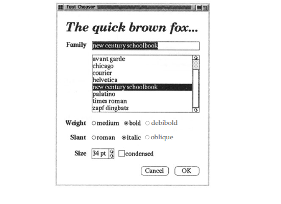
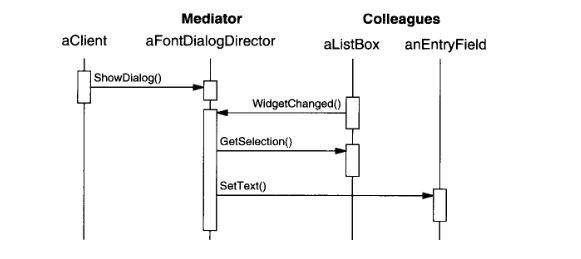
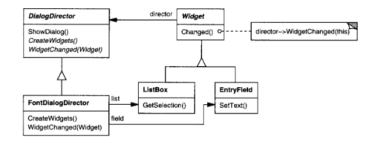
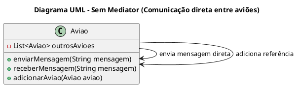
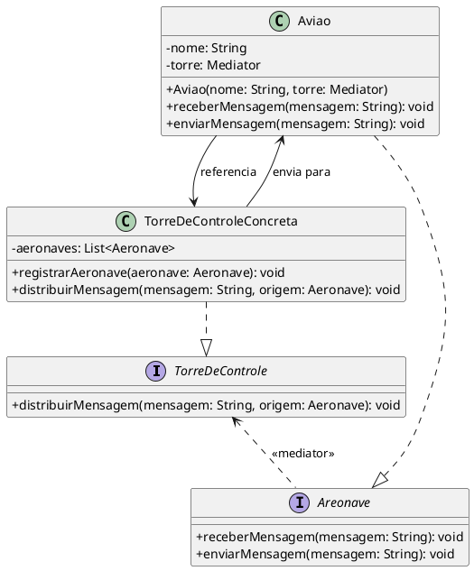
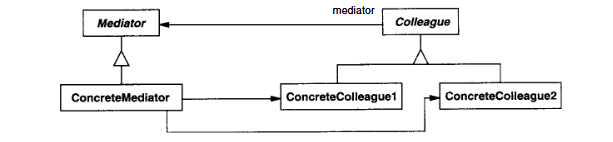
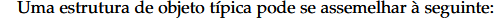
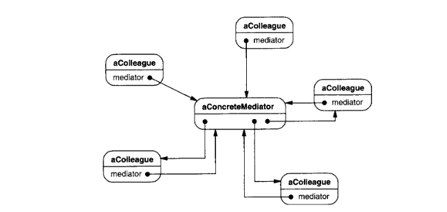

# Mediator

## Intenção

Definir um objeto que encapsula a forma como um conjunto de objetos interage. O Mediator promove o acoplamento fraco ao evitar que os objetos se refiram uns aos outros explicitamente e permite variar suas interações independentemente


## Também conhecido como
Controlador

## Motivação GOF

O projeto orientado a objetos encoraja a distribuição de comportamento entre vários objetos. Tal distribuição pode resultar em uma estrutura de objetos com muitas conexões entre eles; na pior das situações, cada objeto acaba tendo conhecimento sobre todos os outros objetos.

Embora o particionamento de um sistema em muitos objetos geralmente melhore a reusabilidade, a proliferação de interconexões tende a reduzi-la novamente. Muitas interconexões tornam menos provável que um objeto possa funcionar sem o apoio de outros – o sistema funciona como se fosse monolítico.

Além do mais, pode ser difícil de mudar o comportamento do sistema de maneira significativa, uma vez que o comportamento está distribuído entre muitos objetos. Como resultado, você pode se ver forçado a definir muitas subclasses para customizar e adaptar o comportamento do sistema.

Como exemplo, considere a implementação de caixas de diálogo em uma interface gráfica de usuário. Uma caixa de diálogo usa uma janela para apresentar uma coleção de widgets, tais como botões, menus e campos de entrada como mostrado a seguir:



Frequentemente, existem dependências entre os widgets em um diálogo. Por exemplo, um botão torna-se desabilitado quando um certo campo de entrada está vazio. A seleção de uma entrada em uma lista de escolhas pode mudar o conteúdo de um campo de entrada. Reciprocamente, digitar texto no campo de entrada pode selecionar automaticamente uma ou mais entradas correspondentes na list box. Uma vez que aparece texto no campo de entrada, outros botões podem se tornar habilitados, permitindo ao usuário fazer alguma coisa com o texto, tal como mudar ou deletar o item ao qual o mesmo se refere.

Diferentes caixas de diálogo terão diferentes dependências entre widgets. Assim, mesmo que diálogos exibam os mesmos tipos de widgets, não podem simplesmente reutilizar as classes de widget disponíveis no ambiente de desenvolvimento; elas precisam ser customizadas para refletir as dependências específicas de cada diálogo. A customização individual por meio de subclasses seria trabalhosa, já que muitas classes estariam envolvidas.

Você pode evitar esses problemas encapsulando o comportamento coletivo em um objeto Mediator separado. Um Mediator, ou mediador, é responsável pelo controle e coordenação das interações entre um grupo de objetos. Ele funciona como um intermediário, evitando que os objetos do grupo referenciem uns aos outros explicitamente. Assim, os objetos conhecem apenas o Mediator, reduzindo o número de interconexões.

Por exemplo, FontDialogDirector pode ser um Mediator entre os widgets de uma caixa de diálogo. Um objeto FontDialogDirector conhece os widgets de um diálogo e coordena sua interação. Ele funciona como um centro concentrador (hub) de comunicações para os widgets.


O seguinte diagrama de interação ilustra como os objetos cooperam para tratar uma mudança numa seleção num list box:



Aqui está a sequência de eventos que ocorre quando uma list box interage com um campo de entrada:

1. A list box notifica seu diretor (director) que houve uma mudança.

2. O diretor obtém a seleção feita na list box.

3. O diretor então repassa essa seleção para o campo de entrada.

Como agora o campo de entrada contém texto, o diretor habilita os botões que permitem ao usuário realizar uma ação (por exemplo: "seminegrito", "itálico").

Observe como o diretor atua como mediador entre a list box e o campo de entrada. Os widgets não se comunicam diretamente entre si; toda a comunicação passa pelo diretor. Isso significa que os widgets não precisam conhecer detalhes sobre os outros componentes, apenas sobre o diretor.

Além disso, como o comportamento está centralizado em uma única classe (o diretor), torna-se mais fácil modificar ou estender esse comportamento simplesmente substituindo ou herdando essa classe.

A seguir, é mostrado como a abstração FontDialogDirector pode ser integrada a uma biblioteca de classes:



DialogDirector é uma classe abstrata que define o comportamento geral de um diálogo. Os clientes utilizam a operação showDialog para exibir o diálogo na tela. A operação createWidgets é abstrata e responsável pela criação dos widgets de um diálogo. Já a operação widgetChanged também é abstrata e é chamada pelos widgets para notificar o diretor de que houve alguma alteração.

As subclasses de DialogDirector substituem o método createWidgets para instanciar os widgets apropriados ao diálogo específico, e também substituem widgetChanged para lidar com as mudanças de estado desses widgets.

## Motivação

Imagine uma torre de controle de voo em um aeroporto. Sem a torre, cada avião teria que se comunicar diretamente com todos os outros para coordenar pousos e decolagens, o que rapidamente se tornaria caótico. Com a torre atuando como intermediária, cada avião apenas comunica sua intenção à torre, que então gerencia as interações com os demais aviões.


Para evitar isso, existe a torre de controle, que atua como um mediador central. Cada avião apenas comunica sua intenção (pousar, decolar, taxiamento, etc.) diretamente à torre, que então coordena toda a operação de maneira segura e organizada, informando os outros aviões quando necessário.

Esse é exatamente o papel do padrão Mediator em projetos de software: centralizar a comunicação entre objetos, evitando conexões diretas e caóticas.



Sem o Mediator, cada avião teria que conhecer diretamente todos os outros para se comunicar. Com o Mediator (Mediator), os aviões comunicam-se de forma indireta e organizada, promovendo baixo acoplamento.

## Aplicabilidade

**Use o padrão Mediator quando:**

- Um conjunto de objetos precisa se comunicar de maneiras bem definidas, mas essas interações são complexas. As interdependências entre eles acabam se tornando desorganizadas e difíceis de entender.

- A reutilização de um objeto é dificultada porque ele referencia e se comunica diretamente com muitos outros objetos.

- Um comportamento que está distribuído entre várias classes precisa ser customizável ou adaptável, mas sem exigir a criação excessiva de subclasses.

## Estrutura





## Participantes

- **TorreControle (Mediator)**
  - define a interface para comunicação com objetos Colleague.

- **TorreDeControleConcreta (ConcreteMediator)**
  - implementa o comportamento cooperativo ao coordenar os objetos Colleague.
  - conhece e gerencia os colegas.

- **Aeronave (Colleague)**
  - define uma interface comum para os objetos que interagem via Mediator.
  - mantém uma referência para o Mediator.

- **Aviao (ConcreteColleague)**
  - implementa o comportamento específico de um colega.
  - se comunica com outros colegas apenas através do Mediator.

## Colaborações

- Os colegas enviam e recebem solicitações por meio de um objeto Mediator.

- O Mediator é responsável por implementar o comportamento cooperativo, direcionando essas solicitações para os colegas apropriados.


## Consequências

1. **Desacoplamento entre colegas**: os objetos Colleague não precisam conhecer uns aos outros, tornando-os mais reutilizáveis e independentes.
2. **Facilidade de mudanças**: alterações no comportamento de interação entre colegas são centralizadas no Mediator.
3. **Complexidade transferida**: o Mediator pode se tornar muito complexo conforme aumenta o número de colegas ou interações.

## Implementação

1. **Comunicação unidirecional**: os colegas notificam o Mediator, que então toma decisões e aciona outros colegas.
2. **Encapsulamento da comunicação**: a lógica de interação entre objetos deve estar totalmente dentro do Mediator.
3. **Registração dinâmica**: o Mediator pode permitir que colegas sejam registrados dinamicamente.

## Exemplo

### TorreControle - Mediator
```java
package Mediator;

import Colleague.Aeronave;

public interface TorreControle {
    void distribuirMensagem(String mensagem, Aeronave origem);
}
```

### TorreDeControleConcreta - ConcreteMediator
```java
package ConcreteMediator;

import java.util.ArrayList;
import java.util.List;

import Colleague.Aeronave;
import Mediator.TorreControle;

public class TorreDeControleConcreta implements TorreControle {
    private List<Aeronave> aeronaves = new ArrayList<>();

    public void registrarAeronave(Aeronave aeronave) {
        aeronaves.add(aeronave);
    }

    @Override
    public void distribuirMensagem(String mensagem, Aeronave origem) {
        for (Aeronave aeronave : aeronaves) {
            if (aeronave != origem) {
                aeronave.receberMensagem(mensagem);
            }
        }
    }   
}
```

### Aeronave - Colleague
```java
package Colleague;

public interface Aeronave {
    void receberMensagem(String mensagem);
    void enviarMensagem(String mensagem);
}
```

### Aviao - Colleagues Concretos
```java
package ConcreteColleague;

import Colleague.Aeronave;
import ConcreteMediator.TorreDeControleConcreta;
import Mediator.TorreControle;

public class Aviao implements Aeronave {
    private TorreControle torre;
    private String nome;

    public Aviao(String nome, TorreControle torre) {
        this.nome = nome;
        this.torre = torre;
        ((TorreDeControleConcreta) torre).registrarAeronave(this);
    }

    @Override
    public void receberMensagem(String mensagem) {
        System.out.println(nome + " recebeu: " + mensagem);
    }

    @Override
    public void enviarMensagem(String mensagem) {
        System.out.println(nome + " enviando: " + mensagem);
        torre.distribuirMensagem(mensagem, this);
    }
}
```

## Conclusão

O padrão Mediator centraliza e gerencia a comunicação entre objetos, promovendo um sistema mais desacoplado, modular e fácil de manter. Ele é especialmente útil quando as interações entre objetos se tornam complexas e difíceis de rastrear. Assim como a torre de controle em um aeroporto, o Mediator permite uma coordenação clara e segura, mesmo em ambientes com muitos participantes.

## Usos conhecidos

- Interfaces gráficas onde botões, caixas de texto e outros elementos devem reagir aos eventos dos outros.
- Jogos onde entidades diversas (jogadores, inimigos, eventos) precisam interagir de forma controlada.
- Sistemas de mensagens, salas de bate-papo, centrais de comando.

## Padrões relacionados

- **Observer**: ambos promovem o baixo acoplamento, mas o Mediator centraliza a comunicação, enquanto o Observer a distribui.
- **Facade**: simplifica a interface para um subsistema, enquanto o Mediator coordena a comunicação entre objetos existentes.

## Referências

GAMMA, Erich; HELM, Richard; JOHNSON, Ralph; VLISSIDES, John. *Padrões de projeto: soluções reutilizáveis de software orientado a objetos*. 1. ed. Porto Alegre: Bookman, 2000.

